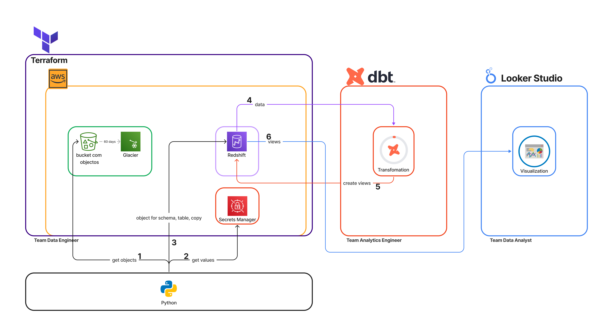
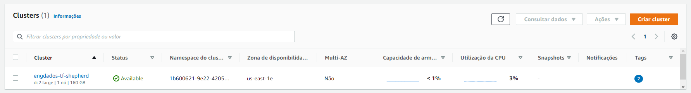
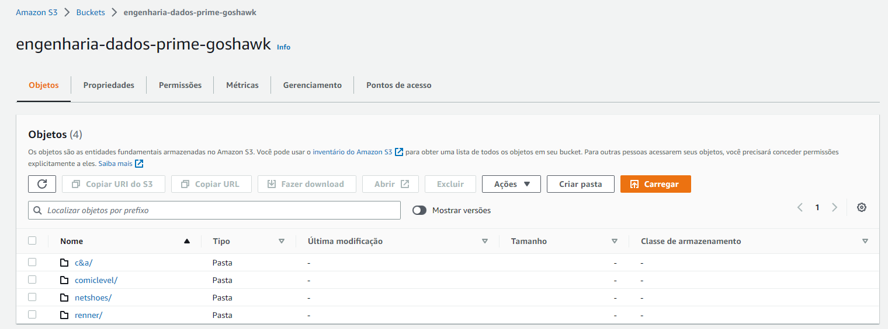
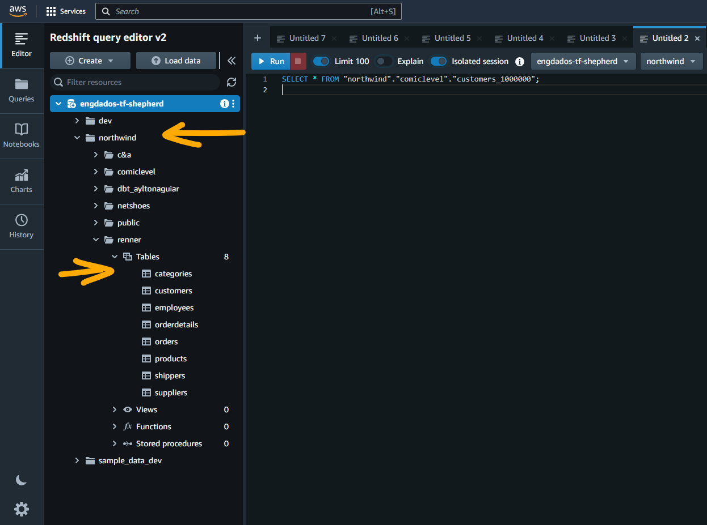
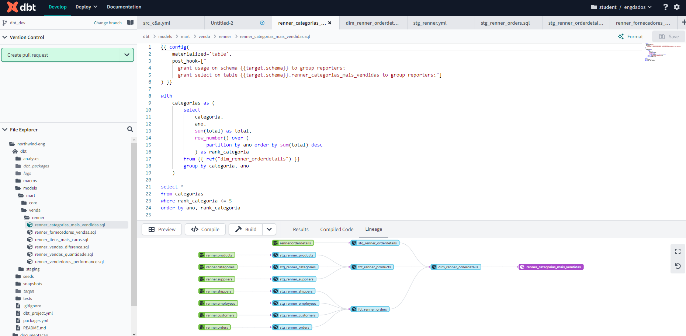
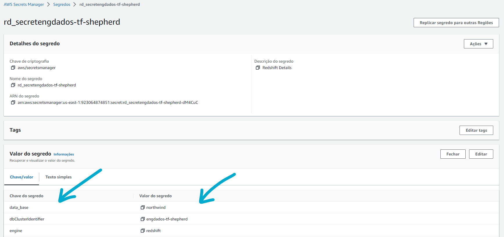

## __Introdução__

A arquitetura do Data Warehouse utiliza a plataforma `Redshift` da Amazon como banco de dados, com armazenamento em `S3` e gerenciamento de segredos com `Secrets Manager`.

O gerenciamento de recursos e adição de objetos são feitos com `Terraform` e a integração e transformação de dados é realizada com `DBT Cloud`.

A visualização é feita com `Looker Studio`.

A automação da transição de dados é realizada pelo `Python`.

## __Tecnologias__

| Linguagens, ferramentas, etc| Descrição |
| :------------- |:-------------|
|Python  | Linguagem de programação de alto nível|
|AWS  | Plataforma de serviços de computação em nuvem, que formam uma plataforma de computação na nuvem oferecida pela Amazon.com|
|Terraform  |  Ferramenta de software de código aberto, infraestrutura como configuração, criada pela HashiCorp|
|dbt Cloud | O dbt Cloud™ é a maneira mais rápida e confiável de implantar o dbt. Desenvolva, teste, programe e investigue modelos de dados, tudo em uma interface do usuário baseada na web.|
|Looker Studio  | Ferramenta gratuita que transforma seus dados em relatórios e painéis informativos totalmente personalizáveis, fáceis de ler e de compartilhar|

## __Diagrama__

## __Banco de Dados__

O banco de dados central utilizado na arquitetura do projeto é o Amazon `Redshift`, que é escalável e oferece alta disponibilidade.

??? example "Expanda para visualizar exemplo"
    

## __Integração de Dados__

No momento os dados são integrados utilizando terraform durante o provisionamento dos recursos, que são executados de forma manual. Os dados integrados são armazenados no Amazon `S3`.

??? example "Expanda para visualizar exemplo"
    

## __Armazenamento de Dados__

Os dados integrados são armazenados no Amazon `Redshift` com auxílio de scripts em `Python` que realizam a leitura, tratamento e armazenamento. Posteriormente são transformados no `DBT cloud` e armazenados em schemas específicos para visualisação e análise dos dados.

??? example "Expanda para visualizar exemplo"
    

## __Transformação de Dados__

A transformação dos dados é realizada com o `DBT Cloud`, que permite a criação de scripts para a transformação dos dados armazenados no Amazon `Redshift`. Além de criação de Jobs e documentações.

??? example "Expanda para visualizar exemplo"
    

## __Análise de Dados__

A análise de dados é realizada através do `Looker Studio`, que permite a criação de relatórios e visualizações interativas dos dados armazenados.

## __Segurança__

A segurança dos dados é garantida com o uso do Amazon `Secrets Manager` para armazenamento seguro das credenciais de acesso, além da segurança oferecida pelo Amazon `Redshift` e Amazon `S3`.

??? example "Expanda para visualizar exemplo"
    
